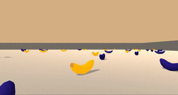

# Self-Driving Car Projects

* [Lane Line Detection](#lane-line-detection)
* [Traffic Sign Classification](#traffic-sign-classification)
* [Behavioral Cloning](#behavioral-cloning)
* [Extended Kalman Filter](#extended-kalman-filter)
* [2D Particle Filter](#2d-particle-filter)
* [Path Planning](#path-planning)
* [PID Controller](#pid-controller)
* [Autonomous Vehicle Control](#Autonomous-vehicle-control)
* [Navigation using Deep Reinforcement Learning](#navigation-using-deep-reinforcement-learning)

## Lane Line Detection

The goal of this proejct is to write a software pipeline to identify the road lane boundaries in a video. The
steps to achieve this goal include the following:

* Compute the camera calibration matrix and distortion coefficients given a set of chessboard images.
* Apply a distortion correction to raw images.
* Use color transforms, gradients, etc., to create a thresholded binary image.
* Apply a perspective transform to rectify binary image (“birds-eye view”).
* Detect lane pixels and fit to find the lane boundary.
* Determine the curvature of the lane and vehicle position with respect to center.
* Warp the detected lane boundaries back onto the original image.
* Output visual display of the lane boundaries and numerical estimation of lane curvature and vehicle position.

See [the code](https://github.com/ken-power/SelfDrivingCarND-AdvancedLaneLines) for this project.

## Traffic Sign Classification

The goal of this proejct is to build a Convolutional Neural Network (CNN) that recognizes traffic signs. The
steps to achieve this goal include the following:

* Load the data set
* Explore, summarize, and visualize the data set
* Design, train, and test a model architecture
* Use the model to make predictions on new images
* Analyze the softmax probabilities of the new images
* Summarize the results with a written report

See [the code](https://github.com/ken-power/SelfDrivingCarND-TrafficSignClassifier) for this project.

## Behavioral Cloning

The goal of this proejct is to use convolutional neural networks (CNNs) to clone driving behavior and train a
self-driving car to autonomously navigate a track. This project has the following requirements:

* Use a simulator to collect data of good driving behavior
* Design, train and validate a model that predicts a steering angle from image data
* Use the model to drive the vehicle autonomously around the first track in the simulator. The vehicle should remain on the road for an entire loop around the track.

See [the code](https://github.com/ken-power/SelfDrivingCarND-BehavioralCloning) for this project.

## Extended Kalman Filter

The goal of this project is to implement a an Extended Kalman Filter (EKF) and use the EFK with noisy LiDAR and RADAR measurements to estimate the state of a moving object of interest. An extended Kalman filter (EKF) is the nonlinear version of the Kalman filter which linearizes about an estimate of the current mean and covariance. In the case of well defined transition models, the EKF has been considered the de facto standard in the theory of nonlinear state estimation, navigation systems, and GPS. The Extended Kalman Filter is also used widely in self-driving cars and sensor fusion.

See [the code](https://github.com/ken-power/SelfDrivingCarND-ExtendedKalmanFilter) for this project.

## 2D Particle Filter

The goal of this project is to implement a 2-dimensional particle filter in C++. The particle filter is
given a map and some initial localization information (analogous to what a GPS would provide). At each time
step the filter will also get observation and control data. This is a sparse localization problem, i.e., we
are building an end-to-end localizer where we are localizing relative to a sparse set of landmarks using
particle filters.

See [the code](https://github.com/ken-power/SelfDrivingCarND-KidnappedVehicle) for this project.

## Path Planning

The goal of this project is to implement a Path Planner that creates smooth, safe trajectories for a self-driving car to follow, enabling the car to safely navigate around a virtual highway in the presence of other traffic.

Project notes:

* The highway track has other vehicles, all going different speeds, but approximately obeying the 50 MPH speed limit. In other words, one objective is to safely navigate around a virtual highway with other traffic that is driving +/-10 MPH of the 50 MPH speed limit.
* We are provided with the car’s localization and sensor fusion data. There is also a sparse map list of waypoints around the highway. The car should try to go as close as possible to the 50 MPH speed limit, which means passing slower traffic when possible.
* Note that other cars will try to change lanes too. The car should avoid hitting other cars at all cost as well as driving inside of the marked road lanes at all times, unless going from one lane to another.
* The car should be able to make one complete loop around the 6946m highway. Since the car is trying to go 50 MPH, it should take a little over 5 minutes to complete 1 loop. Also the car should not experience total acceleration over 10 m/s^2 nor jerk that is greater than 10 m/s^3.

See [the code](https://github.com/ken-power/SelfDrivingCarND-PathPlanning) for this project.

## PID Controller

The goal of this project is to implement a PID controller in C++, and tune the PID hyperparameters, to enable a self-driving car to manoeuvre around a track. The simulator provides the cross track error (CTE) and the velocity (mph) in order to compute the appropriate steering angle. The speed limit is 100 mph. The goal is to drive _safely_ as fast as possible.

_Control_ in this context refers to how we use the steering, throttle, and breaks to move a car where we want it to go. Control is a trickier problem than it might first seem. When a human comes to an intersection, we use our intuition to determine how hard to steer, when to accelerate, or whether we need to step on the brakes. Teaching a computer how to do this is difficult. Control algorithms are often called *controllers*. One of the most common and fundamental of controllers is called the _PID controller_.  

See [the code](https://github.com/ken-power/SelfDrivingCarND-PID-Controller) for this project.

## Autonomous Vehicle Control

The goal of this project is to program a real Self-Driving Car by writing ROS (Robot Operating System) nodes. For this project, I wrote ROS nodes to implement core functionality of the autonomous vehicle system, including traffic light detection, vehicle control, and waypoint following.

See [the code](https://github.com/ken-power/SelfDrivingCarND-Capstone) for this project.

## Navigation using Deep Reinforcement Learning

This project demonstrates how to use Deep Reinforcement Learning to train an agent to navigate in a large, square world and collect bananas.

See [the code](https://github.com/ken-power/DRLND_Navigation) for this project.

